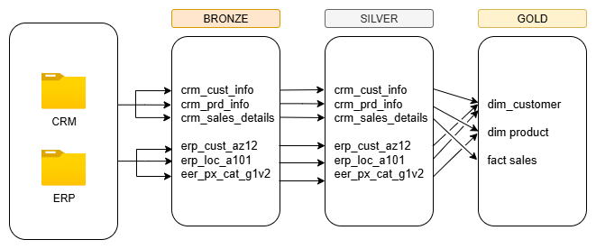

# Data Warehouse Practise Project

This is my small learning project following the **Data with Bara**(https://your-url.com) guide. I used the sample data and suggestions provided to build a simple ELT data ingestion pipeline. 

## Tools

- SQL Server  
- Draw.io  
- Git 
- ChatGPT

## Medallion Tiers

### Bronze Layer
Load files from the source into the database in their original form.

### Silver Layer
Clean the data:
- Remove inconsistencies and duplicates  
- Replace or flag empty values  
- Fix obvious anomalies

### Gold Layer
Shape the cleaned data into a star schema for analytics.

---

## Data Flow Model

Model showing how data flows through each step:  

---

## Data Migration Model

Relationships between tables in Bronze and Silver layers:  

---

## Star Schema (Gold Layer)

Final star schema in the Gold layer:  

